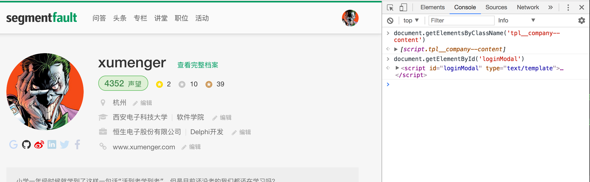
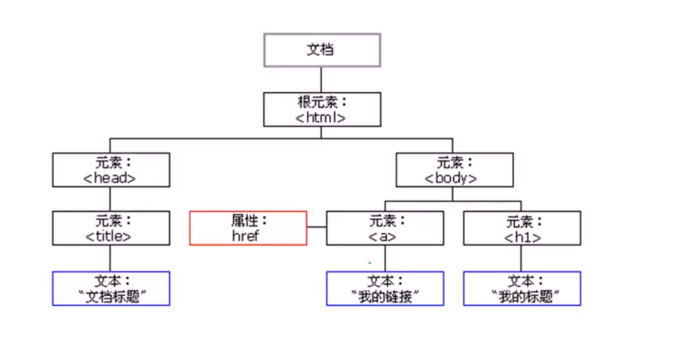

## 分布式爬虫实战

>来自课程[《分布式爬虫实战》](http://www.chinahadoop.cn/course/944)

## 爬虫的基础技术

* Python环境搭建及基础类
* HTML相关技术：HTLM、CSS、JavaScript
* HTTP协议及Python的DOM树选择器
* 宽度与深度抓取介绍及比较
* 不重复抓取策略以及BloomFilter
* 网站结构分析
* 马蜂窝网页抓取案例

HTTPS是以安全为目标的HTTP通道，通常讲是HTTP的安全版，即HTTP下加入SSL层，HTTPS的安全基础是SSL

HTML、CSS、JavaScript我之前都了解过，也都写过简单的前端应用，所以不在这里多说了，详细可以自己再去[w3school](http://www.w3school.com.cn/)学一下

直接在浏览器的开发者工具中打开Console，根据JavaScript的语法可以进行网页元素的筛选处理

DOM树最重要的作用是用来做网页数据分析及提取，我们可以充分利用TAG、CLASS、ID来找出某一类或某一个元素并提取出内容

>分析、提取网页内容的时候，XPATH、正则表达式是极其高效的！

Javascript做网络请求的时候最常用的技术称为AJAX（Asynchronous JavaScript and XML），专门用来异步请求数据，要在网络爬虫中处理这些技术就相对复杂一些了！

[20170716-crawler-big-data-hash](https://github.com/HackerLaboratory/_Laboratory/tree/master/_Idea/_Document)有讲到在网页量极大的情况下该如何处理！

## 

