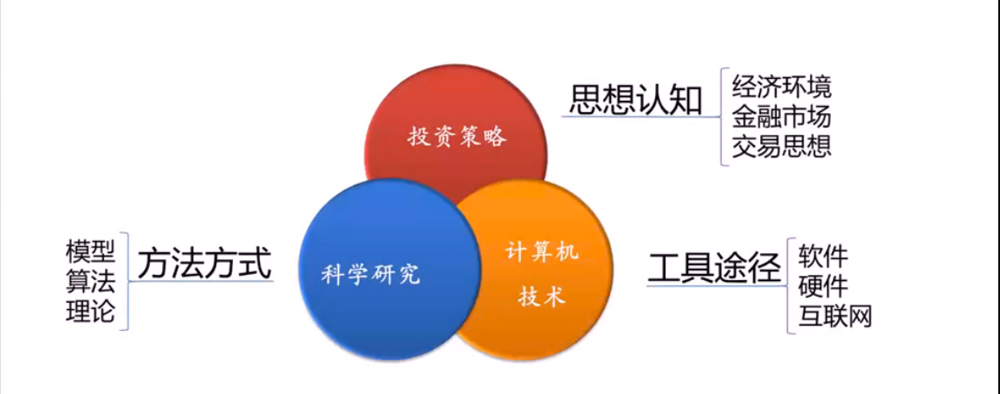

学习资料[《量化投资与机器学习》](http://www.chinahadoop.cn/course/951)

## 量化投资概述

量化投资就是将人的**投资思想**规则化、变量化、模型化，形成一整套完整、可量化的操作思路，这套操作思路可以用历史数据加以分析验证，并在交易的执行阶段可以选择使用计算机自动执行

程序化CTA是最适合想自己涉足量化投资领域的个人去学习的东西，在天语、大宽网上有预制的策略代码，自己做相应的修改就可以去做（天语上可以直接做实盘交易，大宽网目前只能做模拟）

如果有志于在未来去国内外对冲基金从事职业化的专业的股票量化投资组合的工作的话，那么一定要把阿尔法量化投资进行深钻

>数学、统计学、概率论、社会学、分布、回归等理论知识的应用是很重要的！

